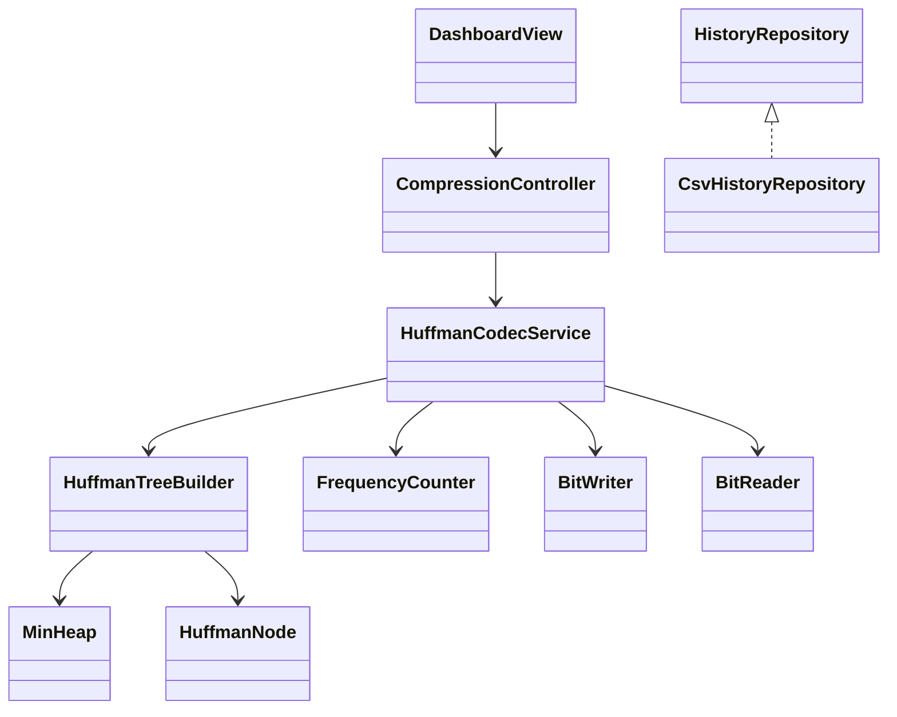
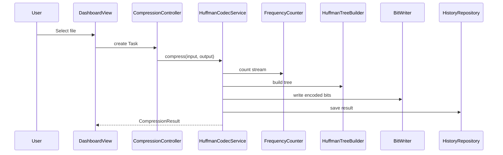
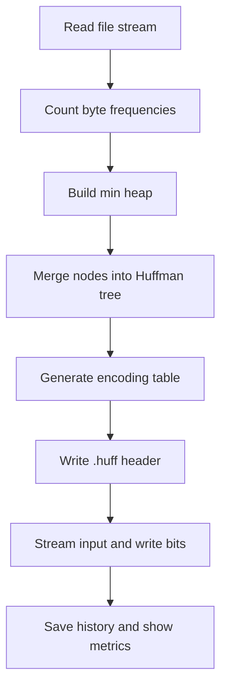

# File Compression Tool

A production-quality Java 21 desktop application that compresses and decompresses files with a from-scratch Huffman Coding implementation. It is designed as a resume-ready DSA project showing greedy algorithms, binary trees, a custom min heap, hash maps, recursion, streams and bit manipulation.

## Features
- Compress any file into a custom `.huff` format.
- Decompress and validate restored output with SHA-256 integrity checks.
- Batch and folder compression service using worker threads.
- JavaFX dashboard with Compress, Decompress, Batch, History, Statistics, Settings and About sections.
- Drag and drop compression, progress indicator, dark/light theme, Material-inspired styling.
- CSV compression history: file name, date, original size, compressed size and ratio.
- Robust error handling for missing, unreadable, unsupported and corrupted files.

## DSA Concepts
- **Huffman Coding:** greedy merge of least frequent symbols creates an optimal prefix code.
- **Binary Tree:** leaf nodes store byte values; internal nodes store combined frequencies.
- **Min Heap:** custom array-backed priority queue supports `add` and `poll` in `O(log k)`.
- **HashMap:** maps byte values to generated bit encodings.
- **Bit Manipulation:** `BitWriter` packs bits; `BitReader` unpacks them during decode.
- **Recursion:** tree traversal generates the encoding table.
- **File Streams:** files are processed in chunks to support large inputs without loading them fully.

## Complexity
- Frequency counting: `O(n)` time, `O(1)` space for 256 byte counters.
- Tree generation: `O(k log k)` time, `O(k)` space where `k <= 256`.
- Encoding/decoding: `O(n)` over bytes/bits, streaming memory usage.

## Installation
```bash
cd file-compression-tool
mvn test
mvn javafx:run
```

## CLI / Programmatic Usage
The core service can be used from tests or future CLI adapters:
```java
HuffmanCodecService codec = new HuffmanCodecService(new CsvHistoryRepository(Path.of("history.csv")));
codec.compress(Path.of("input.txt"), Path.of("input.txt.huff"), progress -> {});
codec.decompress(Path.of("input.txt.huff"), Path.of("restore"), progress -> {});
```

## Folder Structure
```text
src/main/java/com/portfolio/compressor
├── algorithm   # Huffman tree, min heap, frequency counter, encoding table
├── controller  # JavaFX task orchestration
├── exceptions  # Domain exceptions
├── model       # DTOs and records
├── services    # Compression, decompression, batch/folder workflows
├── storage     # History repository
├── utils       # Bit reader and writer
└── view        # JavaFX dashboard
```

## Screenshots Placeholder
Add screenshots in `docs/screenshots/` after launching the JavaFX app.

## UML Class Diagram


## Sequence Diagram


## Flowchart

